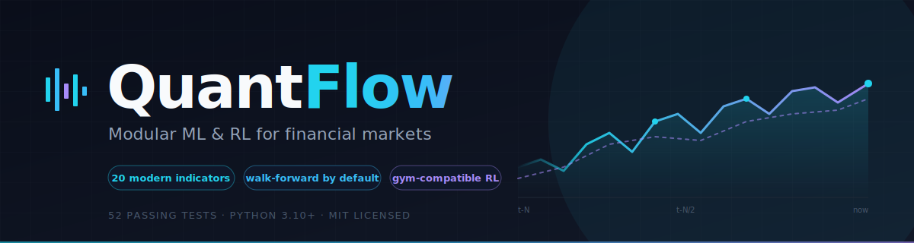

<div align="center">



# QuantFlow

### A next-generation, modular ML/RL library purpose-built for financial markets.

[](https://www.python.org/)
[](LICENSE)
[](tests/)
[](#9-roadmap)
[](#11-contributing)

**20 modern indicators · Walk-forward CV by default · Gym-compatible RL · Real backtest engine**

</div>

---

## ⚡ The 30-second pitch

You're building an ML or RL trading strategy. You open `pandas`, `scikit-learn`, and `gymnasium`, and within an hour you're re-implementing RSI for the third time, your backtest is leaking the future into your training set, and your "Sharpe of 4" evaporates the moment you paper-trade.

**QuantFlow fixes the things generic ML libraries silently get wrong about finance.**

- ✅ **20 research-grade indicators** with closed-form equations and citations — Kyle's λ, VPIN, Hurst, fractional differentiation, realised semivariance, GMM regime probabilities. Not just RSI/MACD.
- ✅ **Walk-forward CV is the default**, not random k-fold. Random k-fold leaks the future into the past — QuantFlow refuses to ship it.
- ✅ **Next-bar-open execution** in the backtester. No same-bar fills. The 0.3-Sharpe inflation that kills published strategies in production isn't possible here.
- ✅ **Gym-compatible `TradingEnv`** with pluggable reward functions — switch between PnL, Sharpe-shaped, sparse-terminal in one import.
- ✅ **Domain-agnostic core** — the env / agent / metric triplet works for robotics, supply chain, and recommender systems too.

```bash
git clone https://github.com/vigilancetrent/quantflow.git
cd quantflow && pip install -e .
python examples/04_advanced_indicators.py   # see all 20 indicators in action
```

> **Status:** v0.1 alpha. Core abstractions, 20+ indicators, backtest engine, and trading RL environment are implemented and tested (52 passing tests). Higher-level models, broker adapters, and distributed training are scaffolded for v0.2+.

---

## 1. Who is this for?

| If you are… | QuantFlow gives you… |
|---|---|
| **A quant researcher** prototyping signals | 20 modern indicators with citations, leak-proof walk-forward CV, fast vectorised backtests |
| **An ML engineer** moving from CV/NLP to finance | A clean `BaseModel` interface that hides PyTorch / sklearn / XGBoost behind one contract |
| **An RL practitioner** trying trading | A realistic `TradingEnv` with commissions, slippage, and pluggable reward shaping |
| **A solo retail algo trader** | A free, MIT-licensed engine that doesn't pretend slippage is zero |
| **A robotics/supply-chain team** | The same env/agent/metric core, with finance bits cleanly isolated |
| **An educator** | A well-documented codebase where every indicator carries the original paper's equation |

## 2. Why another library? — Honest comparison

QuantFlow is not trying to replace `backtrader` or `vectorbt` or `FinRL`. It fills a gap **between** them.

| | `pandas` + `sklearn` | `backtrader` / `vectorbt` | `FinRL` | `gym` + custom code | **QuantFlow** |
|---|:-:|:-:|:-:|:-:|:-:|
| Modern indicators with citations | ❌ | partial | ❌ | ❌ | ✅ 20 indicators |
| Walk-forward CV by default | ❌ | ❌ | ❌ | ❌ | ✅ |
| Next-bar-open backtest semantics | n/a | varies | depends | n/a | ✅ enforced |
| Gym-compatible RL env | ❌ | ❌ | ✅ | ✅ | ✅ |
| Pluggable reward functions | n/a | n/a | partial | manual | ✅ first-class |
| Plugin / registry architecture | n/a | ❌ | ❌ | n/a | ✅ |
| Cross-domain (robotics, recsys) | n/a | ❌ | ❌ | ✅ | ✅ |
| Minimal deps for core | ✅ | ❌ heavy | ❌ heavy | ✅ | ✅ NumPy + SciPy |

QuantFlow's stance: **be the layer underneath your strategy**, not the strategy itself. Indicators and metrics are pure NumPy. Backtest is vectorised. RL is gym-standard. You're never locked in.

## 3. What generic ML libraries get wrong about finance

General-purpose frameworks (TensorFlow, PyTorch, scikit-learn) treat finance as just another tabular or sequence problem. In practice, financial ML has properties that break their default assumptions:

| Problem with generic ML libraries | QuantFlow's response |
|---|---|
| **Non-stationarity** — distributions shift across regimes | Built-in regime detection, online-learning hooks, walk-forward CV |
| **No financial primitives** — you re-implement RSI/MACD/Bollinger every project | First-class, vectorised `quantflow.features.indicators` *plus* 20 modern indicators (microstructure, fractal, regime — see §7) |
| **Leaky validation** — random k-fold leaks future into past | `WalkForwardSplit` is the *default* validator; random k-fold raises a warning |
| **No backtest engine** — you bolt one on with `pandas` and pray | First-class event-driven `BacktestEngine` with slippage/commission models |
| **Weak RL-for-trading story** — Gym envs are toy or finance-naïve | `TradingEnv` with realistic order book, position sizing, transaction costs |
| **No risk metrics** — you import `empyrical` separately | Sharpe, Sortino, max drawdown, Calmar, VaR/CVaR built in |
| **Latency** — Python loops in the hot path | NumPy/Numba kernels for indicators; ONNX export path for inference |

---

## 4. What it solves

### Financial markets (primary)
- **Price & return prediction** — short-horizon (tick→minute) and long-horizon (day→quarter)
- **Volatility forecasting** — GARCH, realised-vol, deep volatility models
- **Algorithmic trading strategies** — signal-based, factor-based, RL-based
- **Risk management & portfolio optimisation** — mean-variance, risk parity, hierarchical risk parity, RL-based allocation
- **Execution** — slippage modelling, smart order routing hooks

### Cross-domain (via the same abstraction)
- **Robotics / control** — reuse `rl/envs` interface for sim2real pipelines
- **Supply chain** — inventory + routing as a sequential decision problem on the same RL stack
- **Recommender systems** — contextual bandits using the same `Agent` base class
- **Any time-series problem** — energy demand, IoT, anomaly detection

The RL environment, agent, and evaluation interfaces are all **domain-agnostic**. Only `quantflow.features.indicators` and `quantflow.execution.broker` are finance-specific.

---

## 5. Project layout

```
quantflow/
├── data/          # Loaders, streams, preprocessing
├── features/      # Indicators (RSI, MACD, BB), time-series engineering
├── models/        # Classical, ML, deep, ensemble — all behind one base class
├── rl/            # Gym-compatible envs + DQN/PPO/SAC agents + reward functions
├── evaluation/    # Metrics (Sharpe, drawdown), backtest engine, risk
├── execution/     # Broker abstraction, order management, live trading
├── core/          # Pipeline, plugin registry, config
└── utils/         # Logging, caching
```

See [`ARCHITECTURE.md`](./ARCHITECTURE.md) for the detailed component diagram and data flow.

---

## 6. Quickstart

```bash
pip install -e .
python examples/01_quickstart.py         # Compute indicators, run a simple model
python examples/02_backtest_strategy.py  # Walk-forward validated momentum
python examples/03_train_rl_agent.py     # Train a PPO agent on the trading env
python examples/04_advanced_indicators.py # Showcase all 20 modern indicators
```

Minimal example:

```python
import numpy as np
from quantflow.features.indicators import rsi, macd, bollinger_bands
from quantflow.evaluation.backtesting import BacktestEngine
from quantflow.evaluation.metrics import sharpe_ratio, max_drawdown

prices = np.cumsum(np.random.randn(500)) + 100  # synthetic price series

signals = (rsi(prices, period=14) < 30).astype(int) - (rsi(prices, period=14) > 70).astype(int)
engine = BacktestEngine(initial_cash=10_000, commission_bps=2.0)
result = engine.run(prices=prices, signals=signals)

print(f"Sharpe:   {sharpe_ratio(result.returns):.2f}")
print(f"Max DD:   {max_drawdown(result.equity):.2%}")
print(f"Final $:  {result.equity[-1]:,.2f}")
```

---

## 7. Modern indicator library (post-classical)

Twenty research-grade indicators ship out of the box, each with the **closed-form equation** and **original citation** in its docstring. They go beyond classical TA (RSI/MACD/Bollinger are still here, but they're table stakes).

### Microstructure & liquidity (`quantflow.features.microstructure`)

| Indicator | What it captures | Citation |
|---|---|---|
| `kyle_lambda` | Price-impact coefficient λ from signed flow | Kyle (1985) |
| `vpin` | Volume-Synchronized Probability of Informed Trading | Easley, López de Prado, O'Hara (2012) |
| `amihud_illiquidity` | Price response per dollar traded | Amihud (2002) |
| `order_flow_imbalance` | Rolling signed-volume share | Cont, Kukanov, Stoikov (2014) |
| `roll_effective_spread` | Implicit bid-ask from autocovariance | Roll (1984) |
| `corwin_schultz_spread` | Daily spread from H/L bars | Corwin & Schultz (2012) |
| `realised_quarticity` | Vol-of-vol / RV precision | Barndorff-Nielsen & Shephard (2002) |

### Fractal & information-theoretic (`quantflow.features.fractal`)

| Indicator | What it captures | Citation |
|---|---|---|
| `hurst_rs` | Long memory (H>½ trend, H<½ revert) | Hurst (1951) |
| `frac_diff_ffd` | Stationarity-preserving fractional differentiation | López de Prado (2018) |
| `sample_entropy` | Signal regularity / predictability | Richman & Moorman (2000) |
| `permutation_entropy` | Ordinal complexity (outlier-robust) | Bandt & Pompe (2002) |
| `lyapunov_rosenstein` | Sensitive dependence / chaos | Rosenstein, Collins, De Luca (1993) |
| `dfa` | Long-range correlation on non-stationary data | Peng et al. (1994) |
| `multiscale_entropy` | SampEn across coarse-graining scales | Costa, Goldberger, Peng (2002) |

### Regime & volatility decomposition (`quantflow.features.regime`)

| Indicator | What it captures | Citation |
|---|---|---|
| `realised_volatility` | √Σr² — model-free integrated variance | Andersen, Bollerslev, Diebold, Labys (2003) |
| `bipower_variation` | Jump-robust integrated variance | Barndorff-Nielsen & Shephard (2004) |
| `realised_semivariance` | Up/down decomposition of RV | Barndorff-Nielsen, Kinnebrock, Shephard (2010) |
| `jump_variation` | RV² − BPV (jumps only) | Barndorff-Nielsen & Shephard (2006) |
| `cusum_change_point` | Two-sided regime-shift detector | Page (1954) |
| `hmm_regime_probability` | P(high-vol regime) via online GMM | Hamilton (1989) |

Run `python examples/04_advanced_indicators.py` to see all twenty fire on a synthetic series.

## 8. Reinforcement learning

QuantFlow ships a **Gym-compatible** `TradingEnv` whose state, action, and reward are all configurable:

| Component | Default | Configurable |
|---|---|---|
| **State** | `[ohlcv_window, indicators, position, cash]` | Any callable returning a `np.ndarray` |
| **Action** | `Discrete(3)` — sell / hold / buy | `Box` for continuous position sizing |
| **Reward** | Δ(portfolio value) − costs | Sharpe-shaped, risk-adjusted, sparse-terminal |

Three reference agents are provided (`DQN`, `PPO`, `SAC`) as thin wrappers over Stable-Baselines3, but any Gym-compatible agent works.

**Known RL-in-finance hazards** that QuantFlow explicitly addresses:
- **Overfitting to history** → walk-forward training, OOD market regime tests
- **Sparse / delayed rewards** → optional dense reward shaping with PnL change
- **Exploration in noisy markets** → entropy bonuses, parameter noise, market-regime curricula
- **Survivorship bias** → data loaders flag delisted assets explicitly

---

## 9. Evaluation metrics

| Family | Metrics |
|---|---|
| **Financial** | Sharpe, Sortino, Calmar, max drawdown, VaR (historic + parametric), CVaR, win rate, profit factor |
| **ML** | RMSE, MAE, R², directional accuracy, log-loss |
| **RL** | Cumulative reward, episode length, policy entropy, value-function loss, KL divergence, regret |

All in `quantflow.evaluation.metrics` — pure NumPy, framework-free.

---

## 10. Roadmap

See [`docs/roadmap.md`](./docs/roadmap.md). Short version:

- **v0.1 (current scaffold)** — indicators, backtest engine, trading env, base classes
- **v0.2** — Numba/Cython hot paths, ONNX export, walk-forward CV utility, GARCH + ARIMA wrappers
- **v0.3** — Distributed training (Ray), live broker adapters (IBKR, Alpaca, Binance), order book features
- **v0.4** — Hybrid Transformer + RL reference architecture, meta-learning / regime-conditioned policies
- **v0.5** — Explainability layer (SHAP for trading decisions), regulatory audit log, paper-trading sandbox
- **v1.0** — API stabilisation, full docs, benchmark suite vs. SOTA finance-ML baselines

---

## 11. Risks & honest limitations

- **Data is the moat.** This library does not ship financial data. Bad data → bad models, no library can fix that.
- **Backtest ≠ live.** Slippage, latency, market impact, and adverse selection are modelled but always under-estimated. Paper-trade before going live.
- **Regulatory exposure.** Automated trading is regulated differently in every jurisdiction (MiFID II, Reg NMS, etc.). QuantFlow provides audit-log hooks but compliance is the operator's responsibility.
- **Ethical use.** Market-manipulating strategies (spoofing, layering) are detectable and illegal. The library refuses to ship reference implementations of them.

---

## 12. Contributing

Architecture decisions are documented in [`docs/design-decisions.md`](./docs/design-decisions.md). The plugin registry (`quantflow.core.registry`) is the recommended extension point — register new models, indicators, environments, or brokers without touching the core.

---

## License

MIT (see `LICENSE`).
